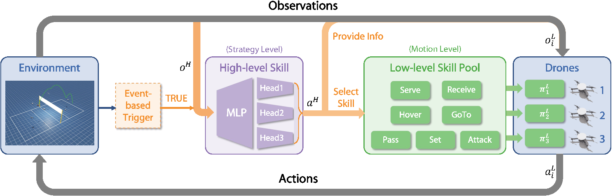

# Mastering Multi-Drone Volleyball through Hierarchical Co-Self-Play Reinforcement Learning

[](https://docs.omniverse.nvidia.com/app_isaacsim/app_isaacsim/overview.html)
[](https://docs.python.org/3/whatsnew/3.10.html)
[](https://opensource.org/licenses/MIT)

This repository is the official implementation of the paper "Mastering Multi-Drone Volleyball through Hierarchical Co-Self-Play Reinforcement Learning".

<p align="center">
[ <a href="https://arxiv.org/pdf/2505.04317"><b>Paper</b></a> ] [ <a href="https://sites.google.com/view/hi-co-self-play"><b>Project Website</b></a> ]
</p>

Ruize Zhang, Sirui Xiang, Zelai Xu, Feng Gao, Shilong Ji, Wenhao Tang,
Wenbo Ding, Chao Yu+, Yu Wang+

[Overview](#overview) | [Installation](#installation) | [Usage](#usage) | [Citation](#citation) | [Acknowledgement](#acknowledgement)

## Overview

We tackle the problem of learning to play 3v3 multi-drone volleyball, a new embodied competitive task that requires both high-level strategic coordination and low-level agile control. To address this, we propose Hierarchical Co-Self-Play (HCSP), a hierarchical reinforcement learning framework that separates centralized high-level strategic decision-making from decentralized low-level motion control. We design a three-stage population-based training pipeline to enable both strategy and skill to emerge from scratch without expert demonstrations.



## Installation

Our simulation environment is based on **Isaac Sim**​​, available for local installation.

#### 1. Isaac Sim

Download the [Omniverse Isaac Sim](https://developer.nvidia.com/isaac-sim) and install the desired Isaac Sim release following the [official document](https://docs.omniverse.nvidia.com/isaacsim/latest/installation/install_workstation.html). 

For this repository, we use the Isaac Sim version **2023.1.0-hotfix.1**. Since this version is not available on the official website, you can download it directly from [here](https://drive.google.com/file/d/1Rt4B3U3nGtnvqXrzTAEa6JcH5OaMxqfY/view?usp=sharing). After downloading, extract the file and move the folder to the following directory:

```bash
mv isaac_sim-2023.1.0-hotfix.1 ~/.local/share/ov/pkg/
```

Set the following environment variables to your ``~/.bashrc`` or ``~/.zshrc`` files :

```bash
# Isaac Sim root directory
export ISAACSIM_PATH="${HOME}/.local/share/ov/pkg/isaac_sim-2023.1.0-hotfix.1"
```

After adding the environment variable, apply the changes by running:

```bash
source ~/.bashrc
```

#### 2. Conda

Although Isaac Sim comes with a built-in Python environment, we recommend using a seperate conda environment which is more flexible. We provide scripts to automate environment setup when activating/deactivating a conda environment at ``HCSP/conda_setup``.

```
conda create -n hcsp python=3.10
conda activate hcsp

# at HCSP/
cp -r conda_setup/etc $CONDA_PREFIX
# re-activate the environment
conda activate hcsp
# install HCSP
pip install -e .

# verification
python -c "from omni.isaac.kit import SimulationApp"
# which torch is being used
python -c "import torch; print(torch.__path__)"
```

#### 3. Third Party Packages
HCSP requires specific versions of the `tensordict`, `torchrl` and `orbit` packages. For this repository, we manage these three packages using Git submodules to ensure that the correct versions are used. To initialize and update the submodules, follow these steps:

Get the submodules:
```bash
# at HCSP/
git submodule update --init --recursive
```

Install `tensordict`:
```bash
# at HCSP/
cd third-party/tensordict
python setup.py develop
```

Before install `torchrl`, first check and update gcc and g++:
```bash
# check gcc version, should be like: gcc (Ubuntu 9.4.0-1ubuntu1~20.04.2) 9.4.0 ...
gcc --version

# if not gcc 9.x, check available gcc
ls /usr/bin/gcc*

# if gcc-9 is not installed
sudo apt update && sudo apt install gcc-9
# if gcc-9 is installed
sudo update-alternatives --install /usr/bin/gcc gcc /usr/bin/gcc-9 100
sudo update-alternatives --config gcc
# then follow instructions to select gcc-9.

# check gcc version again
gcc --version

# apply same update and config to g++
```

Then install `torchrl`:

```bash
# at HCSP/
cd third-party/rl
python setup.py develop
```

Also we need to install `orbit` package of Isaac Sim. Note that currently `orbit` package has been integrated into `Isaac Lab` package, but this branch still uses the standalone `orbit` package (this can be updated in the future). So we manage the older version of `orbit` package using Git submodule. To install the `orbit` package, follow these steps: 

```bash
# at HCSP/
cd third-party/orbit
# create a symbolic link
ln -s ${ISAACSIM_PATH} _isaac_sim

# create environment variable
echo -e "alias orbit=$(pwd)/orbit.sh" >> ${HOME}/.bashrc
source ${HOME}/.bashrc

# building extentions
sudo apt install cmake build-essential
./orbit.sh --install  # or "./orbit.sh -i"
```

#### 4. Verification
```
# at HCSP/
cd scripts
python train.py headless=true wandb.mode=disabled
```

## Usage

<!-- TODO -->
#### 1. Configuration

We use [`hydra`](https://hydra.cc/docs/intro/) to manage the configurations. You can find the configuration files in `cfg`.

File structure of the configuration files:

```bash
cfg
├── train_<TASKNAME>.yaml # training configurations
├── task
│   ├── <TASKNAME>.yaml # configurations for each task
├── algo 
│   ├── <ALGONAME>.yaml # configurations for each algorithm
```

When you run the training script, you can modify the configurations in these yaml files, or you can pass the configurations as command line arguments. For example:

```bash
python train.py headless=true \
    total_frames=1000000000 \
    task=Serve \
    task.drone_model=Iris \
    task.env.num_envs=4096 \
    task.ball_mass=0.005 \
    task.ball_radius=0.1 \
    eval_interval=100 \
    save_interval=100 \
    only_eval=false
```

For experiment tracking, we use [`wandb`](https://wandb.ai/). You need to have a wandb account, and set the `wandb` configurations in the `train.yaml` file. For example:

```yaml
wandb:
  group: <EXPERIMENT_GROUP>
  run_name: <EXPERIMENT_NAME>
  job_type: train
  entity: <YOUR_WANDB_ENTITY>
  project: <YOUR_WANDB_PROJECT>
  mode: online # set to 'disabled' when debugging locally
  run_id:
  monitor_gym: True
  tags:
```

#### 2. Training

We provide training scripts for all tasks presented in our paper, including: (i) 11 low-level skills, (ii) High-level task, and (iii) Co-Self-Play. You can find them in the `scripts/shell` directory. For example, to train a model for the `Serve` task, you can run:

```bash
# at HCSP/scripts/shell
bash serve.sh
```

## Citation

Please cite our paper if you find our paper useful:

```bibtex
@InProceedings{pmlr-v305-zhang25n,
  title = 	 {Mastering Multi-Drone Volleyball through Hierarchical Co-Self-Play Reinforcement Learning},
  author =       {Zhang, Ruize and Xiang, Sirui and Xu, Zelai and Gao, Feng and Ji, Shilong and Tang, Wenhao and Ding, Wenbo and Yu, Chao and Wang, Yu},
  booktitle = 	 {Proceedings of The 9th Conference on Robot Learning},
  pages = 	 {5278--5300},
  year = 	 {2025},
  editor = 	 {Lim, Joseph and Song, Shuran and Park, Hae-Won},
  volume = 	 {305},
  series = 	 {Proceedings of Machine Learning Research},
  month = 	 {27--30 Sep},
  publisher =    {PMLR},
  pdf = 	 {https://raw.githubusercontent.com/mlresearch/v305/main/assets/zhang25n/zhang25n.pdf},
  url = 	 {https://proceedings.mlr.press/v305/zhang25n.html},
  abstract = 	 {In this paper, we tackle the problem of learning to play 3v3 multi-drone volleyball, a new embodied competitive task that requires both high-level strategic coordination and low-level agile control. The task is turn-based, multi-agent, and physically grounded, posing significant challenges due to its long-horizon dependencies, tight inter-agent coupling, and the underactuated dynamics of quadrotors. To address this, we propose Hierarchical Co-Self-Play (HCSP), a hierarchical reinforcement learning framework that separates centralized high-level strategic decision-making from decentralized low-level motion control. We design a three-stage population-based training pipeline to enable both strategy and skill to emerge from scratch without expert demonstrations: (I) training diverse low-level skills, (II) learning high-level strategy via self-play with fixed low-level controllers, and (III) joint fine-tuning through co-self-play. Experiments show that HCSP achieves superior performance, outperforming non-hierarchical self-play and rule-based hierarchical baselines with an average 82.9% win rate and a 71.5% win rate against the two-stage variant. Moreover, co-self-play leads to emergent team behaviors such as role switching and coordinated formations, demonstrating the effectiveness of our hierarchical design and training scheme.}
}
```

## Acknowledgement

This repository is heavily based on [OmniDrones](https://github.com/btx0424/OmniDrones).

Some of the abstractions and implementation was heavily inspired by [Isaac Orbit](https://github.com/NVIDIA-Omniverse/Orbit).
